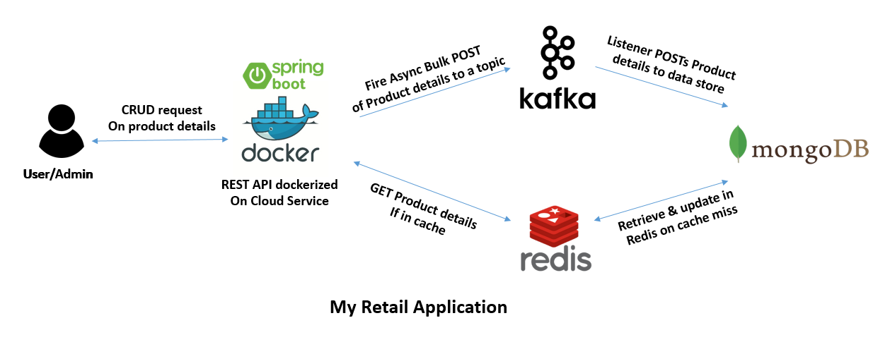

# My Retail Application

myRetail is a rapidly growing company with HQ in Richmond, VA and over 200 stores across the east coast. myRetail wants to make its internal data available to any number of client devices, from myRetail.com to native mobile apps.
* Create a rest API to do a CURD operations and store the data id, current_price, currency_code.
* Assume there is a mongo DB which has product description and reads product information from a NoSQL data store and combines it with the product id and name from the HTTP request into a single response.
* The service should be secured.

## Prerequisites
* MongoDB 4.0
* Redis cache server
* Java 1.8
* Spring-boot 2.1.7
* Kafka 2.12-2.3.0
## Configuration
#### Mongodb
```
host: localhost 
port: 27017
database: demodb
```
#### Redis  
```
host : localhost
port : 6379
```
### Kafka
```
host : localhost
port : 9092
```
#### Basic Authorization credentials
```
user credentials
username : udhay
password : udhay1995
```
```
admin credentials
username : admin
password: admin
```
## Sample JSON POST request
```
http://localhost:8080/products/admin
{
    "id": 89654,
    "product_description": "watch",
    "current_price": 500.60,
    "currency_code": "usd"
}
```
